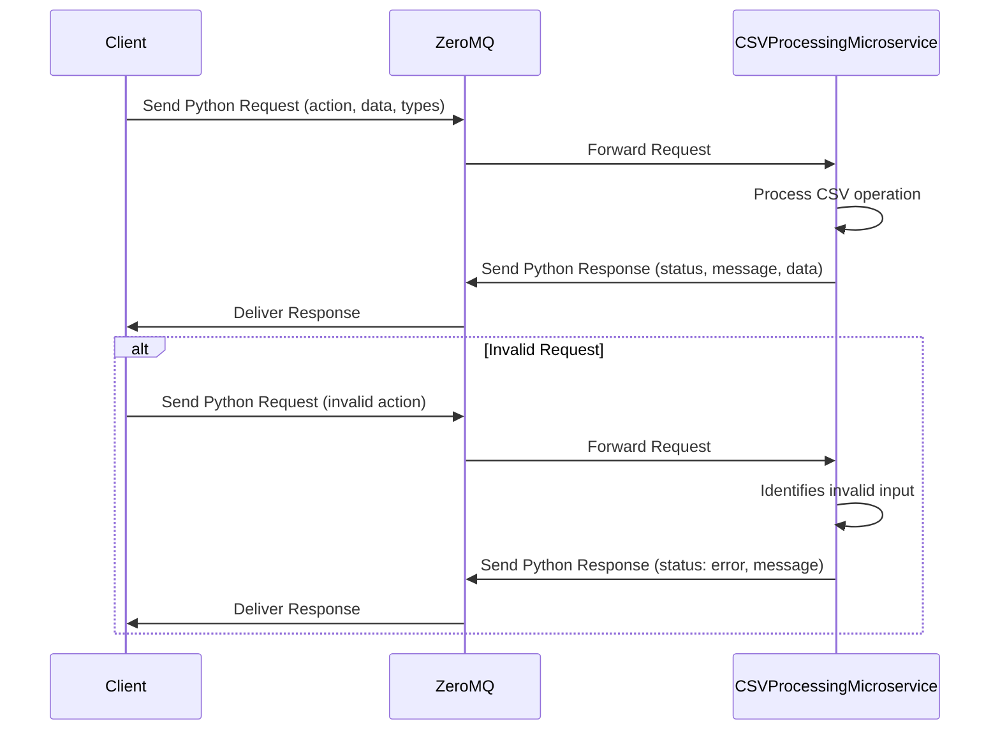

# CSV Processing Microservice
This microservice provides CSV file import, export, and data validation functionality using ZeroMQ communication protocol.
#
# Requesting Data
To request data, send a Python object using ZeroMQ with the following format:
#
## Request Format
* "action": Operation type ("import", "export", or "validate")
* "data": Array of records (for export and validate operations)
* "types": Data type mapping (for validate operation only)
```
{
  "action": "import"
}
```

```
{
  "action": "export",
  "data": [{"name": "Alice", "age": 25}]
}
```


```
{
  "action": "validate",
  "data": [{"name": "Bob", "age": "30", "active": "true"}],
  "types": {"age": "int", "active": "bool"}
}
```
#
## Example Code (Sending a Request with ZeroMQ in Python)
```
import zmq

context = zmq.Context()
socket = context.socket(zmq.REQ)
socket.connect("tcp://localhost:5554")  # Replace with the correct endpoint

request_data = {
    "action": "import"
}

socket.send_pyobj(request_data)
response = socket.recv_pyobj()

print(response)

```
#
# Recieving Data
The response from the microservice will be a Python object.

## Response Format
### Valid Request Example
```
{
  "status": "success",
  "message": "Imported 25 records",
  "data": [
    {"name": "Alice", "age": "25", "salary": "50000.50"},
    {"name": "Bob", "age": "30", "salary": "75000.75"}
  ]
}
```
### Invalid Request Example
```
{
  "status": "error",
  "message": "import.csv not found"
}
```

## Example Code (Recieving a Response)
```
response = socket.recv_pyobj()
response_data = response

if response_data["status"] == "success":
    print(f"Operation successful: {response_data['message']}")
    if "data" in response_data:
        print(f"Received {len(response_data['data'])} records")
else:
    print(f"Operation failed: {response_data['message']}")
```
# UML Sequence Diagram
The following UML sequence diagram shows how the main program interacts with the microservice to request and receive CSV processing operations:

#
## Notes
* This microservice handles CSV import from ./import.csv, export to ./export.csv, and data type validation.
* Requests must include an action field with value "import", "export", or "validate".
* Responses are returned as Python objects for compatibility with ZeroMQ transmission.
* Supported data types for validation: "int", "float", "bool", "str".
* The microservice runs on port 5554 using ZeroMQ REQ/REP pattern.
* For boolean conversion: true, 1, yes, on convert to True; all others convert to False
